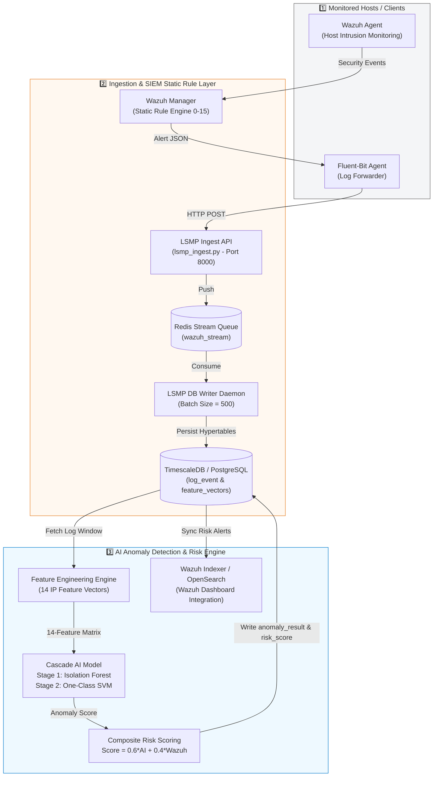

# 🛡️ LSMP: Log Security Monitoring & Prediction Platform

[](https://www.python.org/)
[](https://fastapi.tiangolo.com/)
[](https://www.timescale.com/)
[](https://wazuh.com/)
[](LICENSE)

> **LSMP (Log Security Monitoring Platform)** is an advanced, AI-powered Cyber Security Monitoring and Intrusion Detection Platform. It bridges traditional static SIEM rule enforcement (**Wazuh**) with a high-performance **Two-Stage Cascade Machine Learning Engine (Isolation Forest $\rightarrow$ One-Class SVM)** to deliver real-time anomaly detection, dynamic threat classification, and composite risk scoring across enterprise environments.

---

## 📌 Table of Contents

- [🌟 Key Features](#-key-features)
- [🏗️ System Architecture &amp; Dataflow](#️-system-architecture--dataflow)
- [🧠 AI Engine &amp; Cascade ML Pipeline](#-ai-engine--cascade-ml-pipeline)
- [🧮 Composite Risk Scoring Formula](#-composite-risk-scoring-formula)
- [🛠️ Tech Stack &amp; Infrastructure](#️-tech-stack--infrastructure)
- [📁 Project Directory Structure](#-project-directory-structure)
- [🚀 Getting Started &amp; Installation](#-getting-started--installation)
- [💻 CLI Usage (`lsmp-ai`)](#-cli-usage-lsmp-ai)
- [⚙️ Service Management &amp; Deployment](#️-service-management--deployment)
- [🧪 Verification &amp; Testing](#-verification--testing)
- [📑 Documentation Index](#-documentation-index)
- [📄 License](#-license)

---

## 🌟 Key Features

- **Dual-Pipeline Ingestion**: Real-time log collection from host agents (Wazuh & Fluent-Bit) streaming into high-throughput Redis Stream queues and TimescaleDB hypertables.
- **14-Dimensional Security Feature Extraction**: Dynamic aggregation of host authentication (SSH/Auth), Web HTTP traffic, and behavioral pattern metrics across 60-second sliding time windows per source IP.
- **Cascade Anomaly Detection (IForest $\rightarrow$ OCSVM)**:
  - **Stage 1 (Isolation Forest)**: Rapidly classifies obvious normal traffic and coarse attack spikes.
  - **Stage 2 (One-Class SVM)**: Evaluates borderline samples within the *Uncertainty Zone* to minimize false positives and capture stealthy zero-day threats.
- **Composite Risk Scoring**: Real-time algorithm combining AI anomaly probabilities with Wazuh rule severity levels ($0-15$), categorized into 4 risk tiers (**Low**, **Medium**, **High**, **Critical**).
- **Time-Series Optimization**: Hypertable partitioning, data compression policies, and automated retention lifecycle management backed by TimescaleDB.
- **Enterprise Ready CLI & REST API**: Global `lsmp-ai` Typer CLI, background FastAPI server stack, and containerized Docker Compose deployment.

---

## 🏗️ System Architecture & Dataflow

LSMP operates across three integrated architectural zones linked by a centralized PostgreSQL / TimescaleDB hypertable data layer:



---

## 🧠 AI Engine & Cascade ML Pipeline

The AI core ([`src/lsmp_ai`](file:///home/ngoducvuong/Documents/Projects/LSMP-Projects/LSMP-Project_test/src/lsmp_ai)) extracts 14 dynamic security features grouped into 3 analytical domains:

| Category                    | Features                                                                                                                      | Description                                                                                              |
| :-------------------------- | :---------------------------------------------------------------------------------------------------------------------------- | :------------------------------------------------------------------------------------------------------- |
| 🔑**Auth Domain**     | `auth_failed_count`, `auth_success_count`, `auth_fail_ratio`, `targeted_dest_ips`                                     | Measures authentication failure rates, success/fail ratios, and multi-IP brute-force target counts.      |
| 🌐**HTTP Domain**     | `http_req_count`, `http_4xx_ratio`, `http_5xx_ratio`, `url_entropy`, `user_agent_entropy`, `unusual_method_ratio` | Detects web scanning, directory fuzzing, malicious payload patterns, and HTTP method anomalies.          |
| 📊**Behavior Domain** | `total_events`, `ip_switch_freq`, `event_burst_rate`, `time_span_seconds`                                             | Tracks event frequency bursts, IP switching activity, and event duration metrics within the time window. |

### Cascade Model Routing Protocol

```text
               ┌────────────────────────┐
               │    14-Feature Input    │
               └───────────┬────────────┘
                           │
                           ▼
              ┌──────────────────────────┐
              │ Stage 1: Isolation Forest│
              └────────────┬─────────────┘
                           │
         ┌─────────────────┼─────────────────┐
         │ (Score < Safe)  │ (Uncertain Zone)│ (Score > Danger)
         ▼                 ▼                 ▼
   ┌───────────┐   ┌───────────────┐   ┌───────────┐
   │  NORMAL   │   │ Stage 2: OCSVM│   │  ANOMALY  │
   └───────────┘   └───────┬───────┘   └───────────┘
                           │
                  ┌────────┴────────┐
                  ▼                 ▼
            ┌───────────┐     ┌───────────┐
            │  NORMAL   │     │  ANOMALY  │
            └───────────┘     └───────────┘
```

---

## 🧮 Composite Risk Scoring Formula

The overall threat risk score ($\text{RiskScore} \in [0, 100]$) combines AI-driven anomaly severity with static Wazuh rule levels ($0-15$):

$$
\text{RiskScore} = 100 \times \left( 0.6 \times \text{AIScore} + 0.4 \times \frac{\min(\max(\text{WazuhSeverity}, 0), 15)}{15} \right)
$$

### Risk Level Classification Matrix

|        Risk Score Range        |    Severity Level    | System Action / Dashboard Indicator                       |
| :-----------------------------: | :------------------: | :-------------------------------------------------------- |
|   $0 \le \text{Score} < 30$   |   🟢**LOW**   | Normal activity. Logged for standard audit.               |
|  $30 \le \text{Score} < 60$  |  🟡**MEDIUM**  | Minor anomaly detected. Flagged for review.               |
|  $60 \le \text{Score} < 85$  |   🟠**HIGH**   | Significant threat. High-priority security alert.         |
| $85 \le \text{Score} \le 100$ | 🔴**CRITICAL** | Urgent intrusion alert. Immediate mitigation recommended. |

---

## 🛠️ Tech Stack & Infrastructure

- **Language & Runtime**: Python 3.12+
- **Machine Learning & Data Science**: Scikit-Learn 1.3, Pandas, NumPy, Joblib
- **Web API & Frameworks**: FastAPI, Uvicorn (ASGI), Pydantic v2, Typer CLI
- **Database & Messaging**: PostgreSQL 15, TimescaleDB, Redis 7 (Stream Queue)
- **Log Collection & SIEM**: Wazuh 4.x (Manager & Agent), Fluent-Bit, Grafana Loki, OpenSearch / Wazuh Dashboard

---

## 📁 Project Directory Structure

```text
LSMP-Project/
├── .env.example             # Template environment variable configuration
├── Dockerfile               # Production Docker container definition for LSMP AI Service
├── docker-compose.yml       # Docker Compose setup for infrastructure & AI engine
├── install.sh               # 1-Click automated environment installer script
├── pyproject.toml           # Project package dependencies & build configuration
├── requirements.txt         # Pip requirements specifier
│
├── configs/                 # System YAML configuration files
├── data/                    # Raw & preprocessed datasets for training/testing
├── infrastructure/          # Infrastructure Docker stacks (Redis, Fluent-Bit, Postgres)
├── models_store/            # Versioned trained AI models registry
├── reports/                 # Evaluation reports & benchmark CSV outputs
├── scripts/                 # Service control scripts (start_service.sh, stop_service.sh)
├── src/
│   └── lsmp_ai/             # Core LSMP AI Engine package
│       ├── cli.py           # Typer CLI entrypoint (`lsmp-ai`)
│       ├── common/          # Config loaders & logging modules
│       ├── evaluation/      # Ablation study & model comparison benchmarks
│       ├── feature_engineering/ # 14-feature extraction pipeline
│       ├── io/              # Database & data loader interfaces
│       ├── models/          # Cascade ML model implementations
│       ├── pipeline/        # Training, serving, and evaluation pipelines
│       ├── risk_scoring/    # Composite risk score calculation module
│       └── serving/         # Async Redis queue consumers & batch inference services
└── tests/                   # Pytest test suite
```

---

## 🚀 Getting Started & Installation

### 1. Standalone Automated Setup (1-Click)

The simplest way to install all dependencies and set up the `lsmp-ai` CLI in editable mode:

```bash
chmod +x install.sh
./install.sh
```

### 2. Manual Installation

```bash
# 1. Clone repository
git clone https://github.com/vuong-ngo/LSMP-Project.git
cd LSMP-Project

# 2. Create Python virtual environment (Python 3.12 recommended)
python3 -m venv .venv
source .venv/bin/activate

# 3. Install package and dependencies
pip install -e .
```

### 3. Environment Configuration

Copy `.env.example` to `.env` and adjust database credentials as needed:

```bash
cp .env.example .env
```

---

## 💻 CLI Usage (`lsmp-ai`)

After installation, access the global CLI directly:

```bash
# View CLI help menu
lsmp-ai --help

# 1. Train Cascade Model & register version in models_store/
lsmp-ai train --test-size 0.3 --model-version cascade-v1.0

# 2. Execute serving pipeline over recent feature vectors
lsmp-ai serve --lookback-minutes 60 --limit 100

# 3. Run model evaluation & generate ablation report CSV
lsmp-ai evaluate --output reports/results/bang_3_1_so_sanh_baseline.csv

# 4. Execute comparative benchmark (iForest vs OCSVM vs Cascade)
lsmp-ai compare --output reports/results/benchmark_comparison.csv

# 5. Evaluate pipeline performance on real historical log datasets
lsmp-ai evaluate-real
```

---

## ⚙️ Service Management & Deployment

### Local Background Service Controls

Start or stop the background time-series daemon and FastAPI service:

```bash
# Start background services
./scripts/start_service.sh

# Check service health
curl http://localhost:8000/health

# Stop background services
./scripts/stop_service.sh
```

### Docker Container Deployment

To launch the containerized AI serving stack:

```bash
docker compose up -d --build
```

---

## 📑 Documentation Index

For in-depth operational guides and architectural specifications, refer to the technical manuals:

- 📘 **[Detailed User Guide (`docs/HUONG_DAN_SU_DUNG.md`)](docs/HUONG_DAN_SU_DUNG.md)**: Complete step-by-step user manual for data cleaning, model training, real-time serving, and attack simulation tools.
- 📊 **[Grafana Dashboard Queries (`docs/GRAFANA_QUERIES.md`)](docs/GRAFANA_QUERIES.md)**: Full SQL query collection for Grafana dashboard panels aligned with PostgreSQL `schema.sql`.
- 📑 **[System Architecture Overview (`docs/TONG_QUAN_DU_AN.md`)](docs/TONG_QUAN_DU_AN.md)**: Detailed multi-zone architecture, Redis stream queueing, and end-to-end dataflows.
- 🗄️ **[Database Architecture (`docs/LUU_DU_LIEU_DATABASE.md`)](docs/LUU_DU_LIEU_DATABASE.md)**: Hypertable partitioning, TimescaleDB schema design, and retention policies.
- 📁 **[LSMP AI Engine Manual (`src/lsmp_ai/README.md`)](src/lsmp_ai/README.md)**: Module-level technical breakdown of the `lsmp_ai` package.
- 🌿 **[Git Strategy Guide (`docs/GIT_BRANCHING_STRATEGY.md`)](docs/GIT_BRANCHING_STRATEGY.md)**: Branching, PR conventions, and commit standards.

---

## 📄 License

This project is licensed under the MIT License - see the [LICENSE](LICENSE) file for details.
